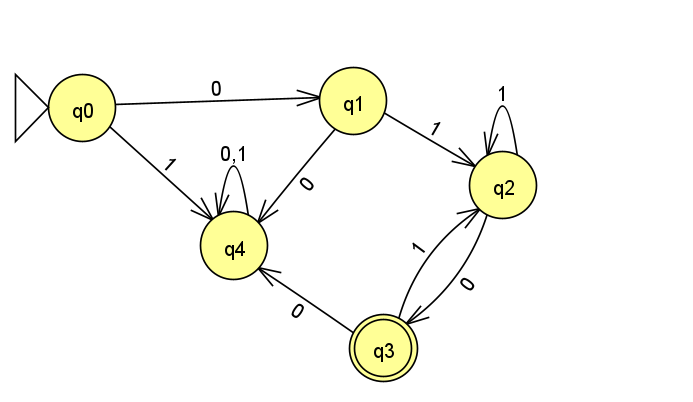
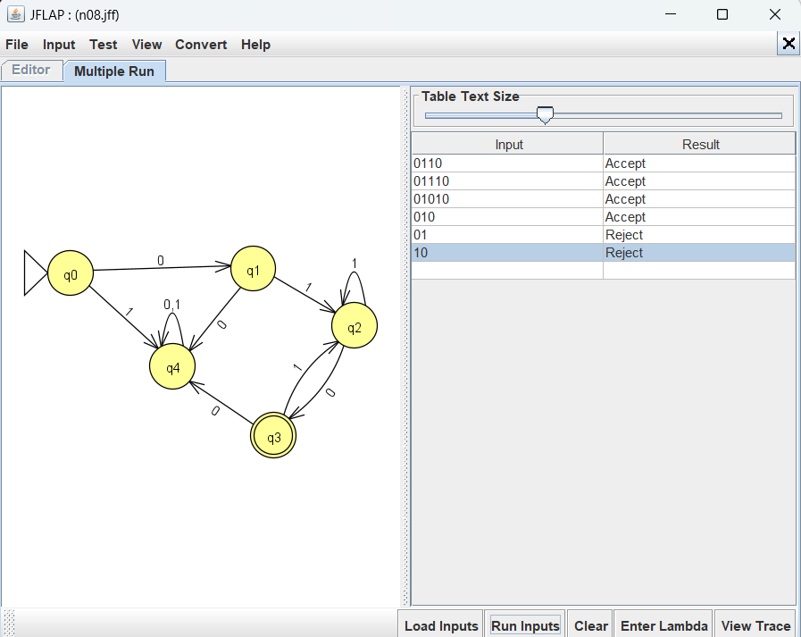
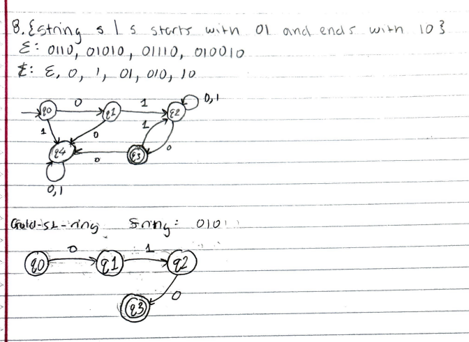
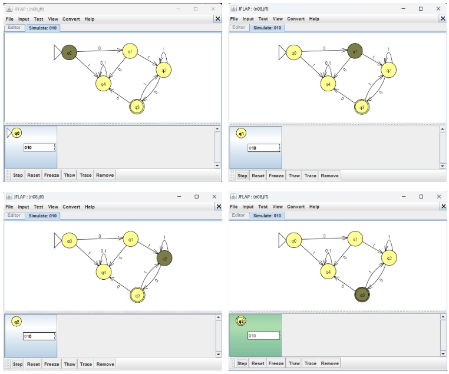

# Problem 08 — Strings that start with `01` AND end with `10`

## NFA

## Test Strings

See [`n08t.txt`](n08t.txt).

## Batch Run

## Gold-St-Ring #1: `01110` and `01010` rejected on first design

**What went wrong:** My first NFA had a self-loop `0,1` on q2 and an
arrow `q2 --1--> q3`. JFLAP routed the q2→q3 arrow through the same
anchor point as the self-loop, so the `1` transition never fired
properly. Short strings like `0110` accepted, but anything requiring
the middle loop (`01110`, `01010`) rejected.

**What I tried:** deleting the self-loop, redrawing the arrow, moving
q3. None worked until I restructured the NFA so the self-loop and the
outgoing transition anchor at different points on q2.

**Lesson:** When two transitions leave the same state on the same
symbol, JFLAP can mis-route them if they visually overlap. In NFAs
(and real state machines), always verify that parallel transitions
have distinct anchor points or use distinct states for distinct roles.

## Gold-St-Ring #2: string `010` (accepted)

### Hand-drawn computation tree

### JFLAP Step with Closure

**What the trace shows:** After reading `010`, the state set does not
contain any final state — the `01`-prefix and `10`-suffix conditions
aren't both satisfied. This string was one of my gold-st-ring cases
because its rejection initially confused me: it *starts* with `01`
but doesn't *end* with `10`, so the suffix condition fails. Tracing
step-by-step confirmed the NFA correctly rejects it.