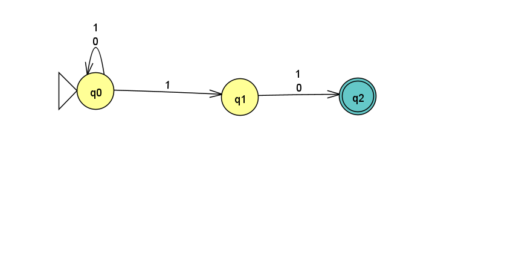
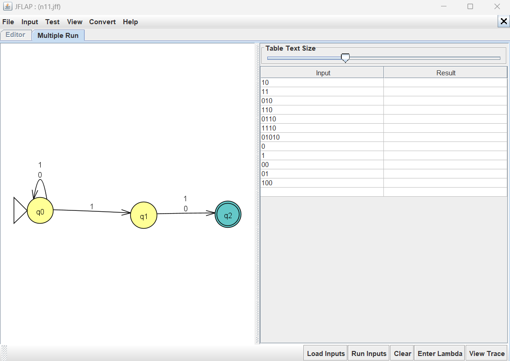

# Problem 11 — Strings whose 2nd-to-last bit is `1`

## NFA

## Test Strings

See [`n11t.txt`](n11t.txt).

## Batch Run

## Design Notes

The NFA guesses when the 2nd-to-last bit occurs. It stays in q0 via
self-loops on `0,1`, then nondeterministically takes `q0 --1--> q1`
to commit that this `1` is the 2nd-to-last bit. From q1, exactly one
more symbol (`0` or `1`) transitions to final q2.

- q0 (start): self-loops on 0 and 1; one transition on 1 to q1
- q1: transitions on 0 and 1 to q2
- q2 (final): accept

## Gold-St-Ring

Initially I reused a 5-state NFA from an earlier attempt, which
accepted only 2 of 7 valid strings. After rebuilding with exactly
3 states — and adding `q0 --1--> q1` **before** the self-loops to
avoid JFLAP's overlapping-transition routing bug (learned from n08)
— all 14 test results matched.

**Lesson:** When a state needs both self-loops and an outgoing
transition on the same symbol, add the outgoing transition first
and anchor it at a different point than the self-loop. This is the
same bug class I hit in n08.