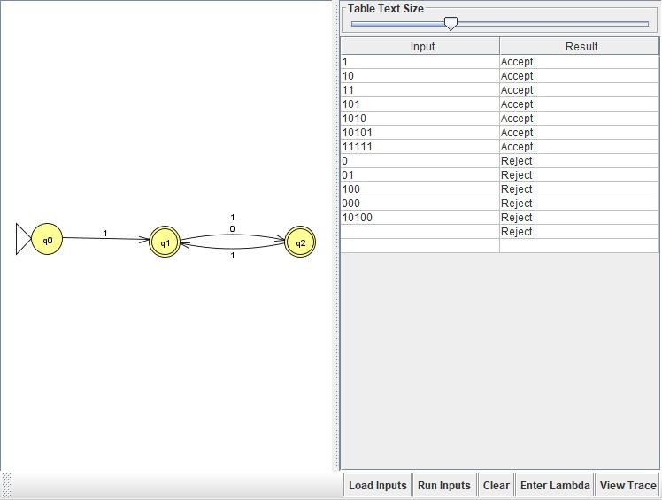
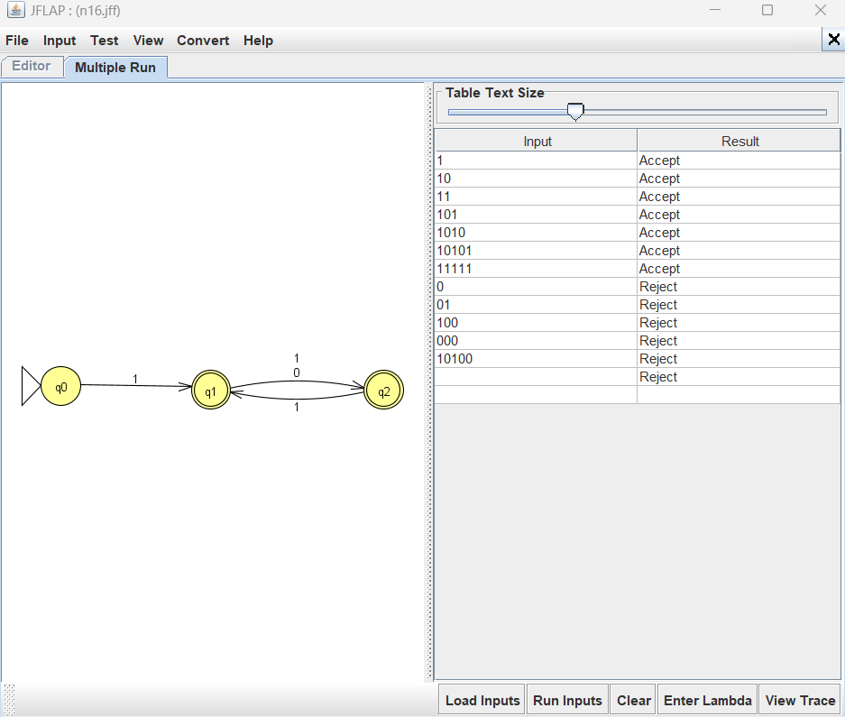

# Problem 16 — Every odd position of s is `1` (positions indexed from 1)

## NFA

## Test Strings

See [`n16t.txt`](n16t.txt).

## Batch Run

## Design Notes

The NFA alternates between two roles:
- **q1**: we just read an odd-position symbol, and it was `1`. String may end here.
- **q2**: we just read an even-position symbol. String may end here.
- **q0**: start; not final (so ε rejects).

| From | To | Symbol |
|------|-----|--------|
| q0 | q1 | 1 |
| q1 | q2 | 0 |
| q1 | q2 | 1 |
| q2 | q1 | 1 |

Notice there is **no `q2 --0-->` transition**. If we're at q2 (expecting an
odd position) and we read `0`, the odd position rule is violated, and the
NFA has no path forward — that branch dies. That's how rejection happens.

## Gold-St-Ring

My first attempt marked only q2 as final, which rejected every
odd-length string (`1`, `101`, `10101`, `11111`). Tracing `1` through the
NFA showed: q0 --1--> q1, and q1 wasn't final → reject. But `1` has
only position 1, which holds `1`, so it should accept. The fix was to
mark **both q1 and q2 final** — the string can end after an odd or even
position, as long as every odd position so far held a `1`.

**Lesson:** When a language constrains positions by parity, ask
"can the string end here?" for **each** state along the accept path,
not just the last one you drew.