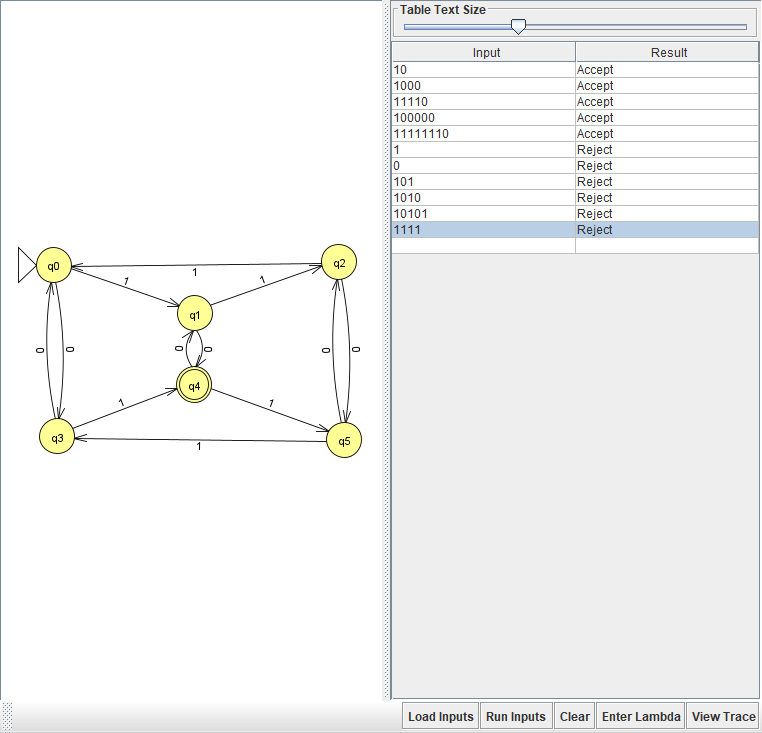
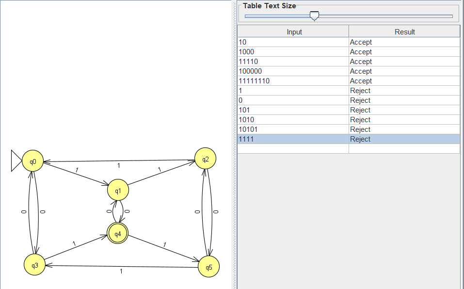
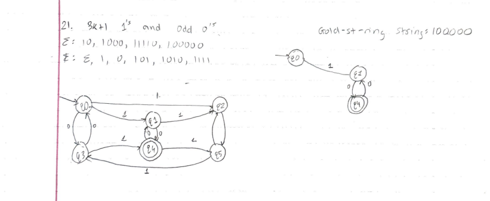
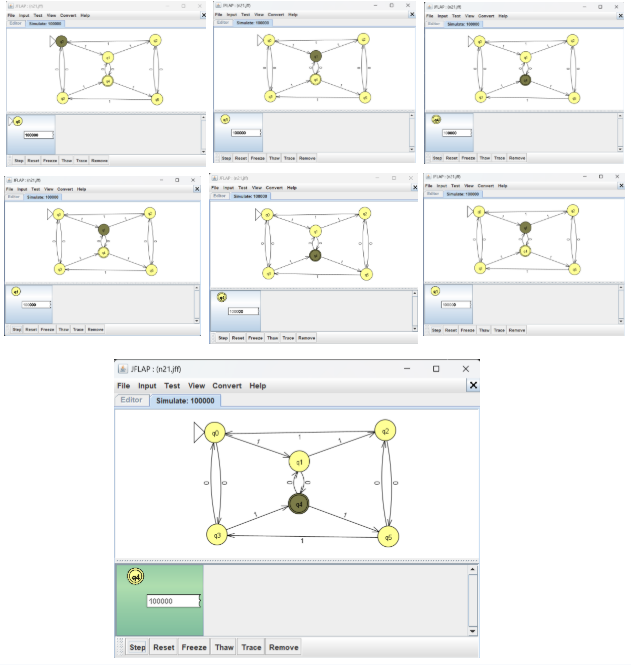

# Problem 21 — `1`s ≡ 1 (mod 3) AND odd number of `0`s

## NFA

## Test Strings

See [`n21t.txt`](n21t.txt).

## Batch Run

## Design Notes

Six states track two simultaneous counters:

| State | #1s mod 3 | #0s parity |
|-------|-----------|------------|
| q0 | 0 | even |
| q1 | 1 | even |
| q2 | 2 | even |
| q3 | 0 | odd |
| q4 | 1 | odd ← **final** |
| q5 | 2 | odd |

**On `1`** (flip #1s mod 3, keep #0s parity):
q0→q1, q1→q2, q2→q0, q3→q4, q4→q5, q5→q3

**On `0`** (flip #0s parity, keep #1s mod 3):
q0→q3, q3→q0, q1→q4, q4→q1, q2→q5, q5→q2

Only **q4** is final (1 mod 3 ✅ AND odd zeros ✅). Start is q0.

## Gold-St-Ring Deep Dive: string `100000` (accepted)

### Hand-drawn computation tree

### JFLAP Step with Closure

**What the trace shows:** `100000` has 1 one and 5 zeros. The NFA
alternates between q1 (1 one mod 3, even zeros) and q4 (1 one mod 3,
odd zeros) as it reads each `0`. After 5 zeros, the state is q4
(1 one mod 3 ✅, 5 zeros odd ✅) → ACCEPT.

This was my hardest gold-st-ring: with the initial packed layout,
long strings requiring multiple q1↔q4 loops were rejected due to
JFLAP's overlapping-transition routing bug. Spreading the states
apart on the canvas fixed it without changing any transition labels.
The step trace confirms each alternation correctly.

## Gold-St-Ring: `100000` and `11111110` were rejected

**Symptoms:** The 5 accepted test strings split into two groups — the
short ones (`10`, `1000`, `11110`) accepted, but the long ones that
require multiple loops through the state machine (`100000` with 5 zeros,
`11111110` with 7 ones) rejected.

**Root cause:** My first layout packed q1 and q4 close together, with
the q1→q4 and q4→q1 `0`-transitions anchored at nearly the same point
on each state's circle. JFLAP's simulator mis-routed the transitions
once you cycled through them more than once — the same overlap bug
I hit in n08.

**Fix:** Spread the six states out on the canvas so all twelve arrows
have clear visual separation. No transition labels changed — only
positions. After the move, all 12 tests passed.

**Lesson:** In JFLAP, whenever a state has **two transitions leaving on
the same symbol** (like q1's two `0` transitions to q4 and q0, or q4's
two `0` transitions to q1 and... etc.), the arrows must anchor at
**visibly distinct points**. When in doubt, spread the states further
apart and re-test after any move. This bug hides on short strings and
only surfaces when the state machine loops.