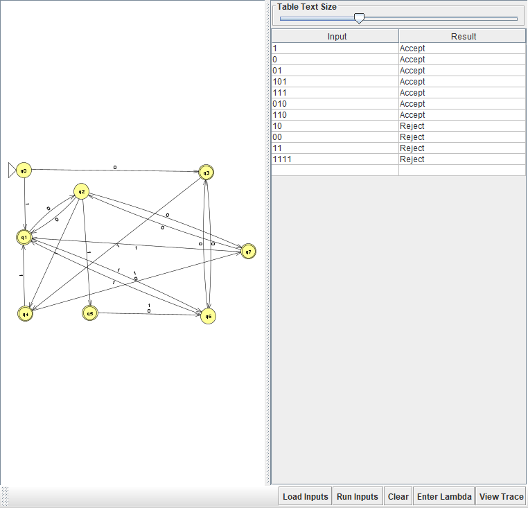
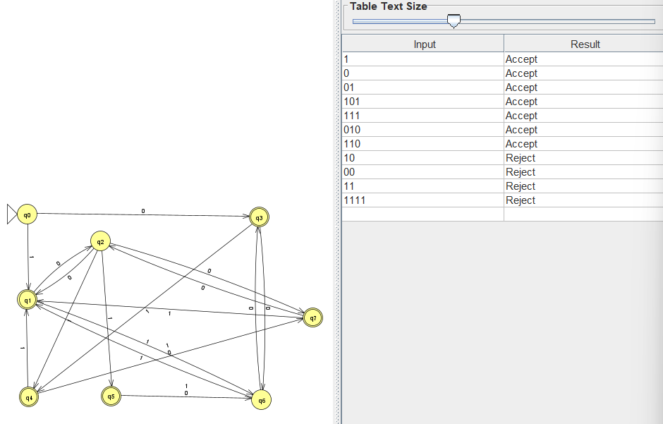

# Problem 23 — Odd length OR `s = 01`

## NFA

## Test Strings

See [`n23t.txt`](n23t.txt).

## Batch Run

## Design Notes

Four states handle the union of two conditions by nondeterministic
branching at the start:

| State | Role | Final? |
|-------|------|--------|
| q0 | start (even length so far for branch A; nothing seen for branch B) | No |
| q1 | branch A: odd length | **Yes** |
| q2 | branch B: seen `0` | No |
| q3 | branch B: seen `01` | **Yes** |

| From | To | Symbol |
|------|-----|--------|
| q0 | q1 | `0, 1` |
| q1 | q0 | `0, 1` |
| q0 | q2 | `0` |
| q2 | q3 | `1` |

## Why Not 8 States (Instructor's Question)

The question notes that a DFA union via product construction would
have Q = Q1 × Q2 = 2 × 4 = 8 states (2 states for length parity, 4
states for tracking the `01` substring). Why is this NFA only 4?

- **NFAs handle union by branching**, not by Cartesian product. We
  nondeterministically run both sub-machines in parallel from q0.
- **The 8-state product is a DFA construction.** Its purpose is to
  ensure every state has exactly one transition per symbol. In an
  NFA, multiple paths can exist, so we don't need to enumerate
  every pair.
- **Even in the DFA**, many of the 8 product states would be
  unreachable or mergeable — minimization would shrink it.

So our NFA is smaller because nondeterminism lets us "guess" which
condition will match at the start of the string and pursue both
possibilities simultaneously.

## Gold-St-Ring

I initially built the 8-state DFA from the product construction. It
rejected `010` and `110`, both of which have odd length (3) and
should therefore accept. Tracing `010` on the DFA showed a
transition bug in the length-parity tracker. Rebuilding as the
4-state NFA (with `q0 --0,1--> q1` and `q1 --0,1--> q0` for length
parity, plus `q0 --0--> q2 --1--> q3` for the `01` branch) passed
all 11 tests immediately.

**Lesson:** When a language is a union, an NFA with branching is
almost always smaller and simpler to build correctly than the
product-construction DFA. Use the DFA only when you specifically
need determinism.